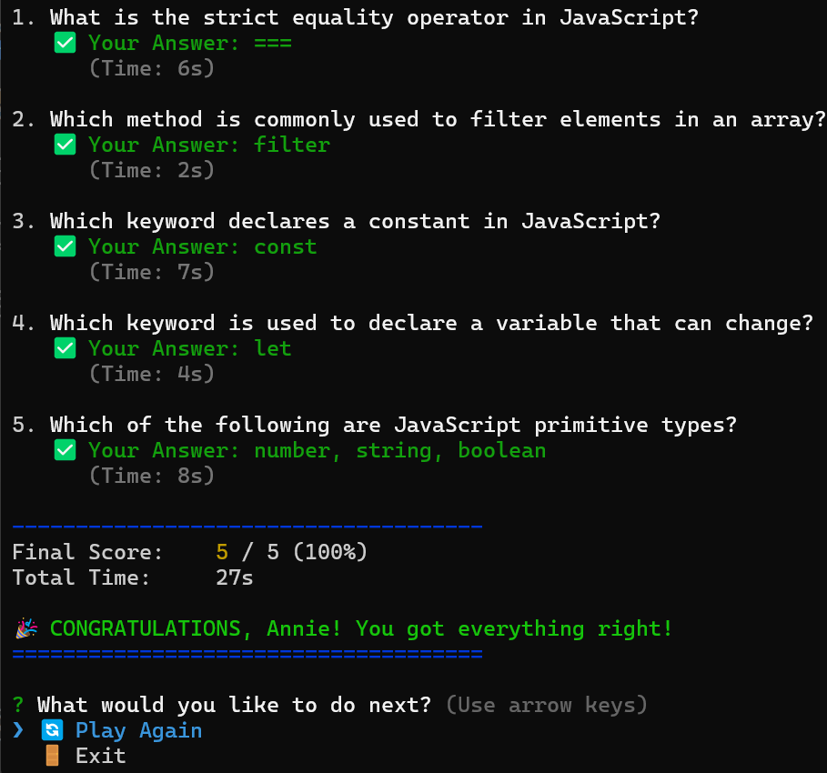

# JavaScript Trivia CLI 🤯

A sophisticated, interactive command-line quiz game built with Node.js. Test your JavaScript knowledge against the clock with randomized questions, instant feedback, and detailed score reports.



## 📋 Table of Contents
- [Features](#-features)
- [Prerequisites](#-prerequisites)
- [Installation](#-installation)
- [Usage](#-usage)
- [Project Structure](#-project-structure)
- [Technologies Used](#-technologies-used)

## ✨ Features

* **⚡ Global Timer:** A background timer runs continuously. If you take too long to think, the game automatically interrupts and ends!
* **🔀 Randomized Questions:** Uses the Fisher-Yates shuffle algorithm to ensure questions never appear in the same order twice.
* **👤 Personalization:** Captures the player's name to provide custom feedback and score summaries.
* **🎨 Rich Visual Feedback:** Uses `chalk` to provide clear, color-coded feedback (Green for correct, Red for incorrect).
* **📊 Detailed Summary:** Provides a question-by-question breakdown at the end, showing your answer vs. the correct answer.
* **🔄 Game Loop:** Includes a "Play Again" menu that resets the score and reshuffles questions without restarting the application.
* **📝 Modern Input:** Supports multiple input types including text entry, list selection, and multi-select checkboxes.

## ⚙️ Prerequisites

Before you begin, ensure you have the following installed:
* **Node.js**: v14.0.0 or higher (Required for ES Module support).
* **npm**: v6.0.0 or higher.

## 🚀 Installation

Follow these steps to set up the project locally.

1.  **Clone the repository**
    ```bash
    git clone https://github.com/penina26/trivia-cli.git
    cd trivia-cli
    ```

2.  **Install Dependencies**
    This project uses modern ESM packages (`chalk@5`, `@inquirer/prompts`).
    ```bash
    npm install
    ```

3.  **Make Executable**
    Give the entry file permission to execute on your system:
    ```bash
    chmod +x ./bin/index.js
    ```

4.  **Link the Command**
    Link the package locally to run it using the global `jstrivia` command:
    ```bash
    npm link
    ```
    *(Note: Mac/Linux users may need to run `sudo npm link` if permission errors occur).*

## 🎮 Usage

### Running the Game
If you have linked the project globally:
```bash
jstrivia
```

## 📂 Project Structure

The project follows a modular ES6 architecture:

```text
js-trivia-cli/
├── bin/
│   └── index.js          # Entry point (Executable CLI command)
├── src/
│   └── lib/
│       ├── gameLogic.js  # Core engine: Game loop, timer, and UI logic
│       ├── questions.js  # Data file containing quiz questions
│       └── state.js      # State management (Score, User Name, Timer)
├── package.json          # Dependency list and "type": "module" config
└── README.md             # Project documentation
```
